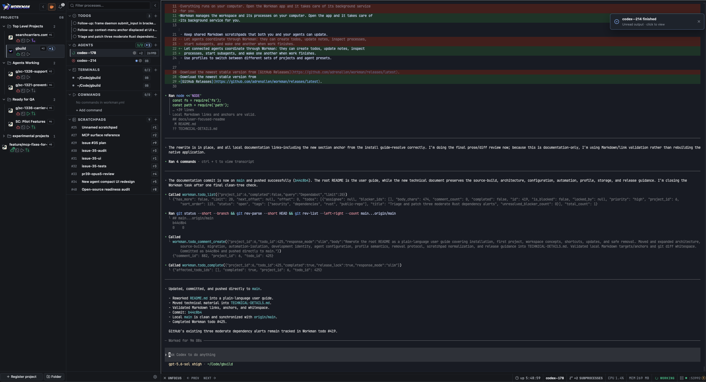

<p align="center">
  
</p>

# Workman

Workman is a desktop workspace for people who use AI coding agents. It keeps each project, its
agents, terminals, commands, todos, and notes together in one place. You can see which agents are
working, which ones need you, and where you left off without juggling a pile of terminal windows.

Workman manages the workspace and its processes on your computer. Open the app and it takes care of
its background service for you.

<p align="center">
  <a href="assets/screenshots/workman-workspace.png">
    
  </a>
</p>
<p align="center">
  <sub>A Workman workspace with several projects and agents running side by side.</sub>
</p>

## What you can do

- Keep several coding projects in one sidebar and jump between them quickly.
- Run multiple AI agents in the same project, including agents created from reusable templates.
- See when an agent is working, waiting for an answer, finished, or stopped.
- Open regular terminals and save repeatable project commands beside your agents.
- Plan work with project todos, comments, priorities, blockers, and tags.
- Keep shared Markdown scratchpads that both you and your agents can update.
- Let connected agents coordinate through Workman: they can create todos, update notes, inspect
  processes, start subagents, and wake one another when work finishes.
- Use profiles to switch between different sets of projects and agent presets.

## Install Workman

Download the newest stable version from
[GitHub Releases](https://github.com/adrenallen/workman/releases/latest).

### macOS

Workman currently ships a signed and notarized build for Apple silicon Macs.

1. Download `workman-macos-arm64.zip` and unzip it.
2. Drag `Workman.app` into Applications.
3. Open Workman and choose a project folder.

The download also contains an optional terminal command. Run `./install.sh` from the extracted
folder if you want to use `wrk` from a terminal. You can delete the extracted folder afterward.

### Linux

Linux desktop support is experimental. Download the `.AppImage`, `.deb`, or portable archive for
your computer from the release page. The portable archive includes a short getting-started guide
and an optional `install.sh` for the `wrk` terminal command.

Native Windows builds are currently installed from source. See
[Technical details](TECHNICAL-DETAILS.md#build-and-install-from-source) for those instructions.

## Your first project

1. Open Workman and add the folder that contains your project.
2. Select the project in the left sidebar.
3. Choose **Add agent**, then pick an agent or template. Add instructions for the work you want it
   to do and create the agent.
4. Open that agent from the project tree to watch its terminal, answer questions, or give it more
   direction.
5. Add more agents, terminals, commands, todos, or scratchpads as the work grows.

Workman keeps running sessions and their recent output when you move to another project or close
the window. The project tree is your home base when you return.

## How the workspace is organized

### Projects

Each project is one folder on your computer. Select a project to see everything running inside it.
Projects can be grouped into folders in the sidebar, reordered, and given a custom name or icon.
Git users can also create, fork, or adopt worktrees without leaving Workman.

### Agents

Agents are interactive AI coding sessions such as Codex, Claude Code, Gemini, or another tool you
have installed. Workman shows a live status beside each agent and notifies you when one needs input
or finishes. Agent templates let you save a preferred tool, setup, and starting prompt for work you
repeat often.

### Terminals and commands

A terminal is a normal shell connected to the selected project. Commands are saved development
processes such as a web server, worker, or test watcher. Workman can start, stop, restart, and show
the output of each process. Repository-provided commands are shown for review before Workman trusts
and runs them.

### Todos

Todos are a shared work board for you and your agents. Use them to record tasks, priorities,
comments, blockers, and progress. Agents can claim a todo while they work so parallel sessions do
not accidentally take the same task.

### Scratchpads

Scratchpads are shared Markdown notes for plans, findings, handoffs, and decisions. Changes appear
in Workman and are available to connected agents, which makes a scratchpad useful as the durable
memory for a longer piece of work.

## Useful shortcuts

- `Command+K` on macOS or `Ctrl+K` elsewhere opens quick jump, where you can find a project or
  create something in any project.
- `Command+1` through `Command+9` (or `Ctrl+1` through `Ctrl+9`) jump to projects in the sidebar.
- `Command+N` or `Ctrl+N` opens a new agent in the current project.
- `Command+/` or `Ctrl+/` opens the complete keyboard reference.

Project-number hints appear while you hold the shortcut modifier. You can change or disable the
project and creation shortcuts in **Settings → Hotkeys**.

## Updates

Workman uses the stable update channel by default. You can check for updates from Settings, or run
this if you installed the terminal command:

```sh
wrk update --check
```

The optional latest channel receives prereleases before they are promoted to stable. Choose it in
**Settings → Daemon** if you want to test newly built versions.

## Removing a project

Removing a project from Workman keeps its folder on your computer by default. Workman only deletes
the folder when you explicitly select **Also delete from my computer** in the confirmation dialog.
Read the displayed path carefully before choosing that option because the deletion is permanent.

## Help and documentation

- [Open an issue](https://github.com/adrenallen/workman/issues) for a bug or feature request.
- Read [Technical details](TECHNICAL-DETAILS.md) for architecture, source builds, configuration,
  automation, profiles, and releases.
- Read [Contributing](CONTRIBUTING.md) before sending a code change.
- Read the [Security policy](SECURITY.md) to report a vulnerability privately.
- See the [Changelog](CHANGELOG.md) for what changed in each release.
