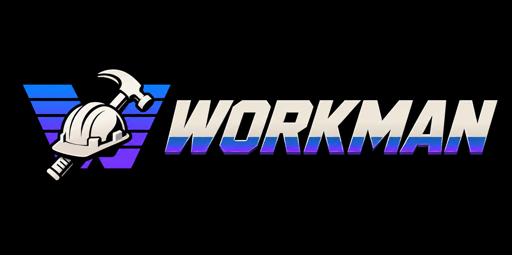

<p align="center">
  
</p>

# Workman

Workman is a native terminal workspace for running AI coding agents alongside a development
stack. A headless Rust daemon will own terminals, process state, persistence, and the local MCP
and control APIs; the CLI and desktop app will be thin clients.

The full project specification, architecture, milestones, and design decisions live in
[PLAN.md](PLAN.md).

## Install

```sh
./install.sh
```

This builds the daemon, CLI, and desktop app in release mode and links them into
`~/.local/bin` without sudo. Re-run it after pulling updates. Then run `wrk` in any
project directory, `wrk app` for the desktop workspace, or `wrk mcp-setup` for Claude Code.
The installer links `wrk`, `workmand`, and `workman-desktop`; it also creates a `workman → wrk`
convenience symlink unless `WORKMAN_INSTALL_ALIAS=0` is set. Obsolete pre-Workman and `gbuild*`
symlinks are removed only after the new binaries link successfully, and running daemons are never
stopped.

On its first default-directory boot, Workman copies data from the most recent pre-Workman identity
when present, otherwise it falls back to `gbuild`. SQLite state and `config.yml` are preserved while
`daemon.json` is regenerated; both source directories remain untouched. Repository commands
belong in `workman.yml`; predecessor configuration and then `gbuild.yml` remain readable with
deprecation warnings.

## Workspace

- `crates/workman-core` — shared domain and service code
- `crates/workmand` — headless daemon binary
- `crates/workman-cli` — `wrk` command-line client
- `apps/desktop` — Tauri 2 desktop app

Run `cargo build --workspace` or `just build` to build the Rust workspace.

## Automation isolation

Automation must target a fresh, disposable Workman data directory rather than whichever daemon a
developer is using. Set the safety guard in every harness or worker environment:

```sh
export WORKMAN_REQUIRE_EXPLICIT_DAEMON=1
export WORKMAN_DATA_DIR="$(mktemp -d /tmp/workman-automation.XXXXXX)"
wrk ps
```

`wrk --data-dir PATH ...` is the equivalent per-invocation form and takes precedence over
`WORKMAN_DATA_DIR`. With the guard set to `1`, daemon-targeting commands fail before discovery or
auto-spawn unless one of those data-directory boundaries is explicit. Supplying `--daemon` alone
only chooses the executable and does not satisfy the isolation guard. Help, version, and update
commands do not target a daemon and remain available.

Each data directory keeps its MCP port and bearer credential in a private
`mcp-endpoint.json` file. The first daemon start selects a free loopback port; later starts reuse
that port and token so configured and already-running agent clients reconnect after an update.
Stable, development, and isolated automation data directories therefore remain independent. If a
persisted port is unexpectedly occupied, the daemon fails with the exact port and state path
instead of silently changing the endpoint. Starting `workmand --port PORT` once explicitly moves
that identity to a chosen free port while preserving its bearer token.

## Side-by-side development build

Keep the stable release open while testing the current checkout with the isolated development
identity:

```sh
scripts/dev-install.sh
wrk-dev app
```

This installs `wrk-dev`, `workmand-dev`, and the visibly badged `Workman Dev.app` without replacing
`wrk`, `workmand`, or `Workman.app`. The dev stack uses its own data, config, daemon discovery, MCP
registration, and bundle id. Re-run the script after source changes; `wrk-dev update` never installs
over either identity. See [GETTING-STARTED-DEV.md](GETTING-STARTED-DEV.md) for paths and workflow.

## Release channels

Releases are built locally on an Apple silicon Mac and published as prereleases first. This is
the **latest** update channel, intended for people who want each newly built version before it
is promoted. The default **stable** channel uses only promoted GitHub releases and therefore
ignores prereleases. Tags do not trigger GitHub Actions; both repository workflows are manual.

Choose a channel in Settings → Daemon, or on the CLI:

```sh
wrk update --check --channel stable
wrk update --channel latest
```

The daemon persists the selected channel with its weekly-update preference in `updates.json`
inside the Workman data directory.

### Cutting a release

Stamp the same version in the workspace, desktop package, and Tauri config; add a dated
CHANGELOG section; commit and push `main`; then preview the complete local build:

```sh
scripts/release.sh --dry-run 0.1.0
scripts/release.sh 0.1.0
```

The command builds one portable archive per platform. `workman-macos-arm64.zip` contains the app,
CLI, daemon, installer, and a human getting-started guide. Each `workman-linux-<arch>.tar.gz`
contains the same pieces with an experimental AppImage; matching `.AppImage` and `.deb` files are
also emitted as standalone alternatives.

Artifacts and release notes are written under `release/vX.Y.Z` and checksummed before the tag
or GitHub prerelease is created. Re-running is safe and resumes from Cargo, npm, and container
caches. After installing and accepting the prerelease, promote it to stable with
`scripts/promote.sh vX.Y.Z`.

The manually dispatched Release workflow remains only as an emergency build-only fallback; it
cannot publish a release.

The checkout itself may still be located at `/Users/g/Code/gbuild`. The product and GitHub
repository are named Workman, but that live working-directory path is intentionally not moved by
the rename.

## User agent tools

Agent commands are owned by the active profile and managed in desktop Settings. On the first boot
after upgrading to profile-aware storage, Workman imports the existing `agent_tools` block from
`workman/config.yml` into the Default profile. Later profile changes are stored in SQLite; the YAML
block remains as a migration source and is not re-applied on every restart. Set `WORKMAN_CONFIG` to
choose the per-user file that also retains global update settings.

```yaml
agent_tools:
  - name: Codex
    command: codex --dangerously-bypass-approvals-and-sandbox
    tool_type: codex
    enabled: true
    # Appended to the original command when restarting a stopped agent.
    resume_args: resume {session_id}
    continue_args: resume --last
  - name: Custom agent
    command: /opt/agents/custom --interactive
    # tool_type is optional and inferred from the command executable.
```

Names are unique within a profile. Unknown `tool_type` values are accepted and use the generic
terminal-prompt attention detector. Resume behavior is preset-level and agent-agnostic:
`resume_args` must contain `{session_id}`, while `continue_args` is the cwd-scoped fallback used
when no captured ID is available. Omitting both always starts that preset fresh. Workman discovers
session IDs passively from supported CLIs' own stores; it never probes or injects input into a PTY.

## Profiles

Profiles switch the loaded project set, project order/selection, terminal shell override, agent
tool presets, and custom agent marks. Existing installs migrate transparently into an active
`Default` profile. Canonical project data follows the project: processes and output history, todos,
scratchpads, worktree metadata, and project appearance are shared if the same path is attached to
more than one profile. Daemon/MCP credentials, update keys, notification history, UI-local theme and
rail preferences, and repository-local `workman.yml` files are global.

Use desktop Settings → Profiles or the CLI:

```sh
wrk profile list
wrk profile create "Demo recording" --empty
wrk profile switch 2 --stop-running
wrk profile export 1 ./main.workman-profile.json
wrk profile import ./main.workman-profile.json --name "Imported main"
wrk profile delete 2
```

A switch refuses to proceed while the outgoing profile has running work unless the desktop cascade
dialog or `--stop-running` confirms the exact stop set. The daemon is not restarted, so the MCP
endpoint and connected global sessions remain stable; a project-scoped session whose project is no
longer active fails project-scope checks loudly. Export archives contain paths, shell choice, agent
presets, and custom agent PNGs. They never contain endpoint tokens, update/download/signing keys,
process environments, output, todos, or scratchpads; presets that appear to embed credentials are
rejected rather than exported.

## Scratchpad Markdown Titles

A scratchpad's `name` is its canonical Markdown H1. When `scratchpad_write` or
`scratchpad_load_from_file` receives content whose first line is `# Title`, Workman stores
`Title` as the scratchpad name and removes that line from the body. Full/content reads return
the body only; heading outlines, title-section reads, and `scratchpad_save_to_file` reconstruct
the H1 from the name. This normalization avoids keeping two title values that can drift apart.
